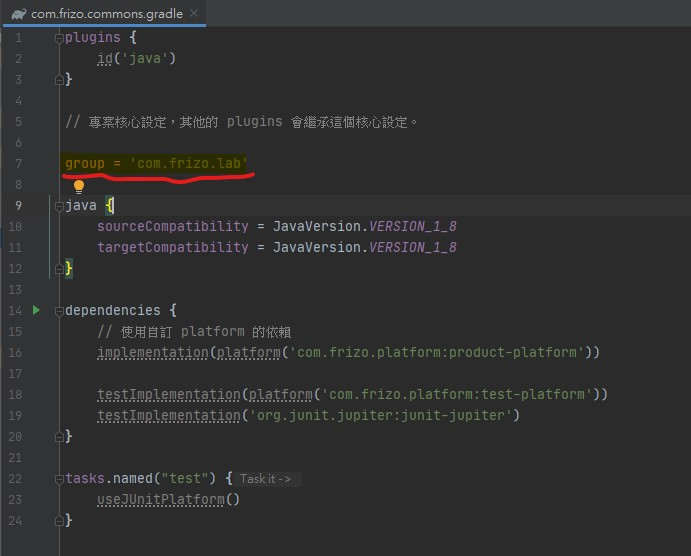

# Gradle 整合大型專案

<br>

---

<br>

建構整合大型專案。參考官方文件：https://docs.gradle.org/current/userguide/structuring_software_products.html

<br>

在本次範例中的專案結構大致如下：

<br>


<br>

最上層的 `frizo-gradle-intergration` 整個專案的包裝，在這一層目錄，我們需要先建立一個 `settings.gradle` 文件：

<br>

```
/frizo-gradle-intergration
    |
    --- settings.gradle
    |
    --- /platforms (專案依賴關係)
    |
    --- /build-logic (通用 plugin 製作)
    |
    --- /common-utils (工具類)
    |
    --- /server-application (Spring Web 應用)
```

<br>

`/frizo-gradle-intergration/settings.gradle` : 

<br>

```groovy
rootProject.name = 'frizo-gradle-Integration'

includeBuild('platforms')
includeBuild('build-logic')
includeBuild('server-application')
includeBuild('common-utils')
```

<br>

在這個最外層的 `setting.gradle` 中，使用 `includeBuild()` 涵蓋 4 個專案。注意不是用 `include()`。

<br>
<br>
<br>
<br>

## platforms 模組

<br>

在此之前，要先了解一下 BOM 是甚麼：https://iter01.com/596109.html

<br>

在這之後，先來看看最重要的模組之一 : `platforms`。這個模組由 3 個部分組成，分別是

 * `plugins-platform`

 * `product-platform`

 * `test-platform`

<br>

以上 3 個部分都屬於 `java-platform` 的繼承體。在每一個的 build.gradle 文件一開始就要寫明

<br>

```java
plugins {
    id('java-platform')
}
```

<br>

`platforms` 模組整體構成圖如下：

<br>


<br>

* `settings.gradle`

    <br>

    settings.gradle 內容如下：


    ```groovy
    rootProject.name = 'platforms'
    // 包含 3 個主體
    include('product-platform')
    include('test-platform')
    include('plugins-platform')
    ```


<br>
<br>

* `product-platform`

    <br>

    先來看一下 `product-platform`，在 `product-platform` 中我們只需要建立一個 build.gradle 文件編輯內容就可以了，不需要其他東西。build.gradle 內容如下：

    <br>

    ```groovy
    plugins {
        id('java-platform')
    }

    group = 'com.frizo.platform'

    // allow the definition of dependencies to other platforms like the Spring Boot BOM
    javaPlatform.allowDependencies()

    dependencies {
        // 使用 BOM 依賴
        api(platform('org.springframework.boot:spring-boot-dependencies:2.4.0'))
    }
    ```

<br>
<br>


* `test-platform`

    <br>

    `test-platform` 跟上面的 `product-platform` 差不多，同樣使用 Junit 5 BOM。

    <br>

    ```groovy
    plugins {
        id('java-platform')
    }

    group = 'com.frizo.platform'

    // allow the definition of dependencies to other platforms like the JUnit 5 BOM
    javaPlatform.allowDependencies()

    dependencies {
        api(platform('org.junit:junit-bom:5.7.1'))
    }

    ```

<br>
<br>

* `plugins-platform`

    <br>


    <br>

    ```groovy
    plugins {
        id('java-platform')
    }

    group = 'com.frizo.platform'

    dependencies {
        // constraints 指定說如果遇到 JAR 檔版本衝突，會強制使用 constraints 裡指定的版號。
        constraints {
            api('org.springframework.boot:org.springframework.boot.gradle.plugin:2.4.0')
        }
    }
    ```

<br>
<br>
<br>
<br>

## build-logic 模組

<br>

build-logic 模組大致上結構如下：

<br>


<br>

這些都是客製化 `gradle plugins`，首先要做的是最基礎的 `commons` 這個 plugin。

<br>
<br>

* `commons` 套件

    <br>

    先看一下 build.gradle

    <br>

    ```groovy
    plugins {
        id('groovy-gradle-plugin')
    }
    ```

    <br>


    文件內容說明了這個套件是 `groovy-gradle-plugin`，也就是說關於套件詳細設定說明，會寫在固定的地方例如：`src/main/groovy/com.frizo.commons.gradle`，下面來看一下內部細節設定：

    <br>

    `src/main/groovy/com.frizo.commons.gradle`

    <br>

    ```gradle
    plugins {
        id('java')
    }

    // 專案核心設定，其他的 plugins 會繼承這個核心設定。

    // 這個 group 設定之後，可以在引用這個 commons 套件的 gradle 設定上使用 ${group} (後面會講解)
    group = 'com.frizo.lab' 

    // 繼承 commons 的設定會統一使用 java_1.8
    java {
        sourceCompatibility = JavaVersion.VERSION_1_8
        targetCompatibility = JavaVersion.VERSION_1_8
    }

    dependencies {
        // 使用自訂 platform 的依賴
        implementation(platform('com.frizo.platform:product-platform'))

        testImplementation(platform('com.frizo.platform:test-platform'))
        testImplementation('org.junit.jupiter:junit-jupiter')
    }

    tasks.named("test") {
        useJUnitPlatform()
    }
    ```

<br>
<br>

* `java-library` 套件

    <br>

    build.gradle 一樣也是 `groovy-gradle-plugin`。

    <br>

    ```gradle
    plugins {
        id('groovy-gradle-plugin')
    }

    dependencies {
        implementation(platform('com.frizo.platform:plugins-platform'))

        implementation(project(':commons'))
    }
    ```

    <br>

    這裡的 `dependencies` 有 2 個部分，拆開來說明。

    <br>

    `implementation(platform('com.frizo.platform:plugins-platform'))`，可以理解承繼成了 `plugins-platform` 的設定。

    <br>

    `implementation(project(':commons'))`，可以理解繼承了 `commons` 的設定。

    <br>

    接下來看一下內部 groovy 的設定：

    <br>

    `src/main/groovy/com.frizo.java-library.gradle`：

    <br>

    ```gradle
    plugins {
        id('com.frizo.commons')
        id('java-library')
    }
    ```

    <br>

    意思是說，當 `com.frizo.lab.java-library` 這個 plugin 被其他設定套用，都會隱性的載入

    * `id('com.frizo.commons')`
        
    * `id('java-library')`

<br>
<br>

* `spring-boot-application` 套件

    <br>

    先看一下 `build.gradle` 的內容：

    <br>

    ```gradle
    plugins {
        // 宣告為一個 'groovy-gradle-plugin'
        id('groovy-gradle-plugin')
    }

    dependencies {
        // plugins-platform BOM 使用
        implementation(platform('com.frizo.platform:plugins-platform'))
        // 繼承 commons 的依賴
        implementation(project(':commons'))
        // 由於上面使用 platform，所以這邊宣告 gradle.plugin 可以不用指定版本，版本資訊都寫在 plugins-platform 裡了。
        implementation('org.springframework.boot:org.springframework.boot.gradle.plugin')
    }
    ```

    <br>

    `src/main/groovy/com.frizo.spring-boot-application.gradle` 內容：

    <br>

    ```gradle
    plugins {
        id('com.frizo.commons')
        id('org.springframework.boot')
    }

    dependencies {
        implementation('org.springframework.boot:spring-boot-starter-web')
        implementation('org.springframework.boot:spring-boot-starter-thymeleaf')
    }
    ```

<br>
<br>
<br>
<br>

## common-utils 套件

<br>

整個 `common-utils` 的結構如下：

<br>


<br>

先看一下 settings.gradle：

<br>

* settings.gradle

    <br>

    ```gradle
    // == 定義 build logic 位址 ==
    pluginManagement {
        repositories {
            gradlePluginPortal()
        }
        includeBuild('../build-logic')
    }

    // == 定義 components 位址 ==
    dependencyResolutionManagement {
        repositories {
            mavenCentral()
        }
        includeBuild('../platforms')
    }

    // == 定義 component 內部結構 ==
    rootProject.name = 'common-utils'
    include('io-util')
    include('greeting-util')
    ```

    <br>

    在上面的 settings 中，定義了客製化 plugin 來源為 `../build-logic`，同時還有依賴關系定義來源 `../platforms`。

    <br>
    <br>

* greeting-util 套件

    <br>

    看一下 build.gradle 內容：

    <br>

    ```gradle
    plugins {
        // 套用 com.frizo.java-library plugin
        id('com.frizo.java-library')
    }

    group = "${group}.common-utils"

    dependencies {
        implementation('com.fasterxml.jackson.core:jackson-databind')
    }
    ```

    <br>

    這邊的 `${group}` 跟先前的 commons 設定呼應：

    <br>

    

    <br>

    `com.frizo.java-library` 繼承了 commons，所以在這裡使用 `${group}.common-utils` 等於 `com.frizo.lab.common-utils`。

    <br>

    code 的部分：

    <br>

    

    <br>

    HelloUtil.java 裡面的東西很簡單：

    <br>

    ```java
    package com.frizo.common.utils.greeting;

    public class HelloUtil {

        public static String sayHello(String guestName){
            return "Hello ! welcome " + guestName + "!";
        }

    }
    ```

    <br>
    <br>

* io-util 套件

    <br>

    io-util 跟 greeting-util 結構一樣，這邊就不重複說明了。

    <br>


<br>
<br>
<br>
<br>

## server-application 套件

<br>

整個 `server-application` 的結構如下：

<br>


<br>

先看一下 settings.gradle：

<br>

* settings.gradle

    ```gradle
    // == 定義 build logic 位址 ==
    pluginManagement {
        repositories {
            gradlePluginPortal()
        }
        includeBuild('../build-logic')
    }

    // == 定義 components 位址 ==
    dependencyResolutionManagement {
        repositories {
            mavenCentral()
        }
    }
    includeBuild('../platforms')
    includeBuild('../common-utils')

    // == 定義 component 內部結構 ==
    rootProject.name = 'server-application'
    include('app')
    ```

    <br>
    <br>

    接下來看一下 `app` 的內部結構：

    <br>

    

    <br>
    <br>

* app: build.gradle

    <br>

    ```gradle
    plugins {
        // 使用 spring-boot-application plugin
        id('com.frizo.spring-boot-application')
    }

    group = "${group}.server-application"

    dependencies {
        implementation('com.frizo.lab.common-utils:greeting-util')
        implementation('com.frizo.lab.common-utils:io-util')
    }
    ```

    <br>

    接下來就是簡單的在 `app` 這個套件裡實現一個 spring-boot-web。下面就不演示了。

<br>
<br>
<br>
<br>

## gradle 命令

<br>

* `gradle -q projects`

    <br>

    可以看到使用這個指令之後，就可以看到專案大框架結構。

    <br>

    ```cmd
    $> gradle -q projects

    ------------------------------------------------------------
    Root project 'frizo-gradle-Integration'
    ------------------------------------------------------------

    Root project 'frizo-gradle-Integration'
    No sub-projects

    Included builds
    +--- Included build ':platforms'
    +--- Included build ':build-logic'
    +--- Included build ':server-application'
    \--- Included build ':common-utils'
    ```

    <br>
    <br>

    這個時候如果 cd 進其中一個專案，再次使用 `gradle -q projects` 會看到一些不一樣的資訊：

    <br>

    ```cmd
    $> cd server-application

    $> gradle -q projects

    ------------------------------------------------------------
    Root project 'server-application'
    ------------------------------------------------------------

    Root project 'server-application'
    \--- Project ':app'

    Included builds
    +--- Included build ':build-logic'
    +--- Included build ':platforms'
    \--- Included build ':common-utils'

    ```


